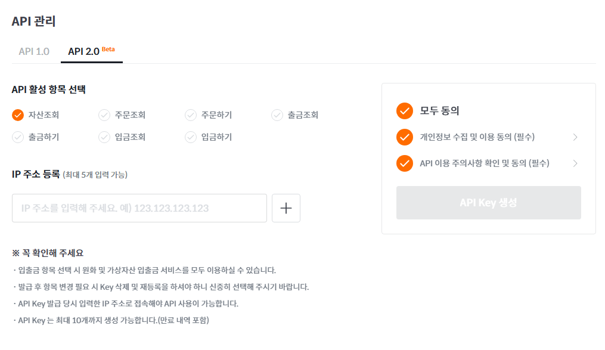
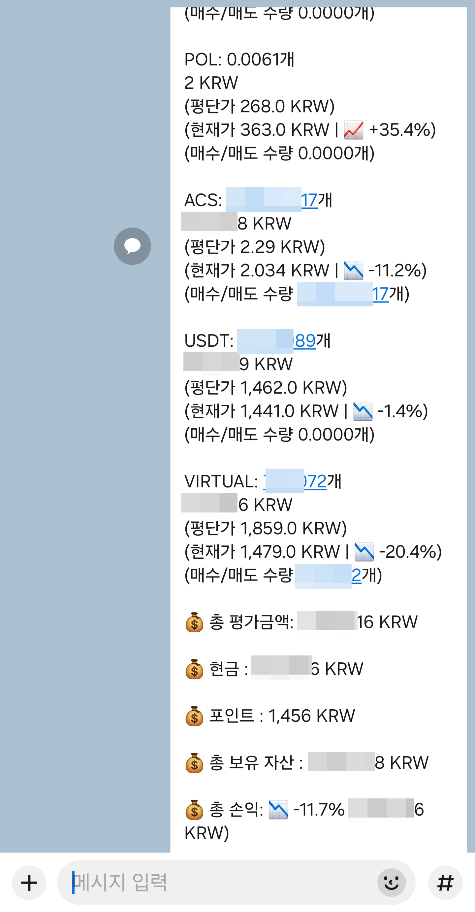

# bithumb-kakao-api

## 빗썸 api 발급
[빗썸 apikey 발급](https://www.bithumb.com/react/api-support/management-api)

> 나는 자산, 주문조회만 했다   신청하고 secret 키는 한번밖에 안보여주므로 따로 저장해야 한다.   주문, 출금, 입금은 키 탈취 당하면 망할거 같아서 난 사용안함.

## 결과
> 난 해당 코드를 linux에 올려서 30분마다 자동으로 실행하여 내 카카오톡으로 전송되도록 만들어서 사용하고 있다.

